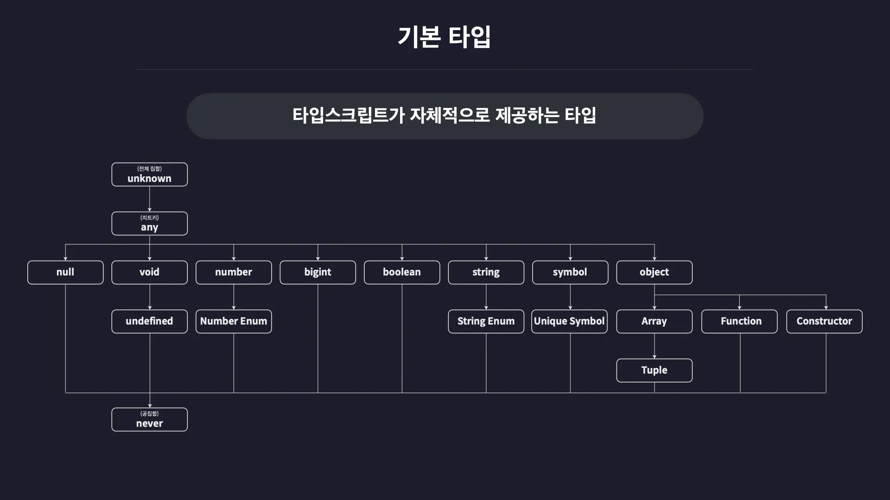

## [2-1] 타입스크립트의 기본 타입

### 기본 타입 (Basic Types)
- 타입스크립트가 자체적으로 제공하는 타입들을 말함
- 기본 타입들은 서로 부모-자식 관계를 이루며 계층을 형성함



---

### 원시 타입 (Primitive Type)
- 동시에 한 개의 값만 저장할 수 있는 타입들을 말함
- 원시 타입은 여러가지 타입들 중 가장 기본이 되는 타입
- 원시 타입에는 number, string, boolean 등이 있음

#### number 타입
- 자바스크립트에서 숫자를 의미하는 모든 값을 포함하는 타입
- 정수, 소수, 음수, Infinity, NaN 등이 포함됨
- number 타입으로 정의한 변수에는 number 타입을 제외한 값을 할당할 수 없음
- number 타입의 값이 사용할 수 없는 toUpperCase 등의 메서드도 사용 불가

```typescript
/* number 타입 */
let num1: number = 123; // :타입 -> type annotation
let num2: number = -123;
let num3: number = 0.123;
let num4: number = -0.123;
let num5: number = Infinity;
let num6: number = -Infinity;
let num7: number = NaN;
```

#### string 타입
- 문자열을 의미하는 타입
- 쌍따옴표(""), 작은 따옴표(''), 백틱(\`\`), 템플릿 리터럴(\`${}\`)로 만든 모든 문자열을 포함함

```typescript
/* string 타입 */
let str1: string = 'hello';
let str2: string = "hello";
let str3: string = `hello`;
let str4: string = `hello ${num1}`;
```

#### boolean 타입
- 참과 거짓만을 저장하는 타입
- true 또는 false만 이 타입에 해당됨

```typescript
/* boolean 타입 */
let bool1: boolean = true;
let bool2: boolean = false;
```

#### null 타입
- 오직 null 값만 포함하는 타입

```typescript
/* null 타입 */
let null1: null = null;
```

#### undefined 타입
- 오직 undefined 값만 포함하는 타입

```typescript
/* undefined 타입 */
let unde1: undefined = undefined;
```

---

### 리터럴 타입 (Literal Type)
- 하나의 값만 포함하도록 값 자체로 만들어진 타입
- 리터럴리 값 자체가 해당 값의 타입이 됨

```typescript
/* 리터럴 타입 */
let numA: 10 = 10;
let strA: 'hello' = 'hello';
let boolA: true = true;
```